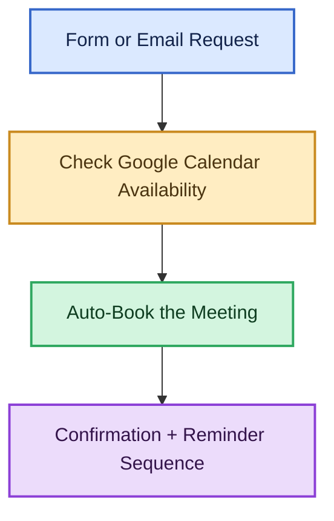

# n8n Meeting Scheduler / Calendar Concierge

An n8n workflow that turns a meeting request — from a **web form** or an **inbound email** — into a fully booked Google Calendar event, with zero human in the loop:



This project showcases two things n8n is particularly good at:

- **API integration** — reading free/busy data and creating events via the Google Calendar API, sending mail via Gmail.
- **Delayed, multi-step follow-ups** — using n8n's `Wait` node to schedule a 24-hour reminder, a 30-minute reminder, and a post-meeting follow-up, all from a single execution.

## How it works

1. **Intake** — a request comes in through an n8n-hosted form, or an email is parsed (with an LLM) to pull out the requester's name, email, purpose, preferred date/time, duration, and timezone.
2. **Availability check** — the workflow queries Google Calendar's free/busy API across a search window and walks working hours to find the first open slot that fits the requested duration.
3. **Auto-book** — if a slot is found, it creates a Google Calendar event (optionally with a Google Meet link) and invites the requester. If nothing is free, it emails back with the nearest alternatives instead.
4. **Confirmation + reminders** — a confirmation email goes out immediately, followed by a 24-hour-before reminder, a 30-minute-before reminder, and a post-meeting follow-up — each fired by its own `Wait` node.

## Repo structure

```
workflows/
  meeting-scheduler.json   n8n workflow, importable directly into your n8n instance
docs/
  architecture.md          node-by-node breakdown of the workflow
  setup.md                 credentials and configuration needed to run it
```

## Status

- [x] Intake: form + email triggers, AI parsing, normalization
- [x] Availability check against Google Calendar
- [x] Auto-booking
- [x] Confirmation + reminder sequence
- [x] Setup & architecture docs

## Requirements

- An n8n instance (cloud or self-hosted)
- A Google account with the Calendar API enabled (OAuth2 credential in n8n)
- A Gmail credential in n8n (or swap in any SMTP/email node)
- Optional: an OpenAI (or other LLM) credential, used to parse free-form email requests into structured data

See [docs/setup.md](docs/setup.md) for step-by-step configuration, and [docs/architecture.md](docs/architecture.md) for a node-by-node breakdown of the workflow.
