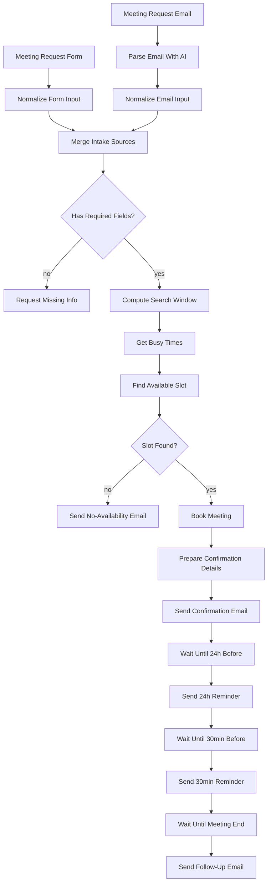

# Architecture

## Flow



## Stage breakdown

### 1. Intake
Two triggers feed the same pipeline: a **Form Trigger** (structured fields) and an **IMAP Email Trigger** (free text, parsed by an LLM in **Parse Email With AI**). Each path has its own normalize step (`Normalize Form Input`, `Normalize Email Input`) so both converge on the same shape:

```
{ name, email, purpose, requestedDate, requestedTime, duration, timezone, source }
```

`Merge Intake Sources` (mode: combine/multiplex, 2 inputs) just lets whichever branch actually ran continue down a single path — only one trigger fires per execution, so there's never real data on both inputs at once.

`Has Required Fields?` guards against incomplete requests (missing name/email/date/time) and routes them to a clarification email instead of trying to book garbage data.

### 2. Availability check
`Compute Search Window` turns the requested date/time + timezone into a concrete `requestedStart` and a `[windowStart, windowEnd]` range (requested time through +14 days) for the calendar query. `Get Busy Times` calls Google Calendar's free/busy API (resource: `calendar`, operation: `availability`) over that range.

`Find Available Slot` (Code node) does the actual scheduling logic in JS:
- Normalizes whatever shape the free/busy response comes back in.
- Walks forward in 15-minute increments within working hours (default 9am–5pm, Mon–Fri), skipping anything that overlaps a busy period.
- Returns the first slot that fits the requested duration, plus up to 3 alternatives.

This is a plain Code node rather than relying on a single Calendar API call because Google's free/busy endpoint returns *busy periods*, not *open slots* — turning that into "the first available 30-minute slot honoring business hours" is exactly the kind of logic n8n's Code node is meant for.

### 3. Auto-book
`Slot Found?` branches on the result. If nothing was found, `Send No-Availability Email` lists the alternatives Find Available Slot already computed, so the requester isn't left to guess. If a slot was found, `Book Meeting` creates the event via Google Calendar's `event.create`, inviting the requester's email and requesting calendar-side notifications (`sendUpdates: all`).

### 4. Confirmation + reminder sequence
This is the delayed/multi-step follow-up part of the showcase. `Book Meeting`'s output replaces the item's JSON with the Calendar API's event response — it doesn't carry the requester's name/email/purpose forward. `Prepare Confirmation Details` re-merges that event data with the original request (pulled via `$('Find Available Slot').first().json`) so every downstream node has both.

From there it's a straight chain of `Wait` → `Send Email`, repeated three times:

| Step | Resumes at | Sends |
|---|---|---|
| `Wait Until 24h Before` | `slotStart - 24h` | 24-hour reminder |
| `Wait Until 30min Before` | `slotStart - 30min` | 30-minute reminder |
| `Wait Until Meeting End` | `slotEnd` | Post-meeting follow-up |

Each `Wait` node uses **Resume: At Specified Time**. If the target time has already passed by the time execution reaches that node (e.g. the meeting was booked same-day, inside the 24-hour window), n8n resumes immediately rather than waiting — so the sequence degrades gracefully for short-notice bookings instead of erroring.

## Data shape reference

The object flowing through the pipeline after normalization:

```json
{
  "name": "Ada Lovelace",
  "email": "ada@example.com",
  "purpose": "Product sync",
  "requestedDate": "2026-07-14",
  "requestedTime": "14:00",
  "duration": 30,
  "timezone": "America/New_York",
  "source": "form"
}
```

...gains `requestedStart`, `windowStart`, `windowEnd` after **Compute Search Window**, then `slotFound`, `slotStart`, `slotEnd`, `alternativeSlots` after **Find Available Slot**, then `eventId`, `eventLink`, `meetingLink` after **Prepare Confirmation Details**.

## Extension ideas

- Swap Gmail for Slack/Teams/SMS to reach requesters on their preferred channel.
- Add a cancellation path: a second form/email intent that finds the booked event by requester email and deletes it, short-circuiting any pending `Wait` nodes for that execution.
- Support multiple organizer calendars by looking up the right calendar ID from the request (e.g. by purpose or team) instead of hardcoding `primary`.
- Persist bookings to a database/sheet for reporting, since each execution's `Wait` nodes make in-workflow state the only record otherwise.
